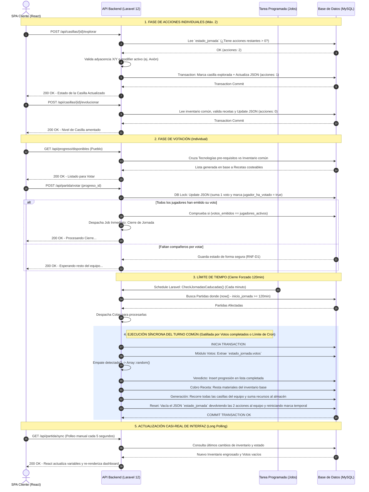

# Diagrama de Secuencia - Ciclo de Jornada (MVP)

Basado en el documento `resumen.md` y adaptado a la arquitectura tecnológica elegida (React + Laravel 12 + MySQL), este diagrama modela el flujo exacto de las operaciones que suceden en un ciclo de juego o "Jornada".

Se ha tenido en cuenta la regla de usar **Long Polling** para la sincronización casi en tiempo real y el uso intensivo de la columna JSON `estado_jornada` para no sobrecargar de registros temporales la BD.

